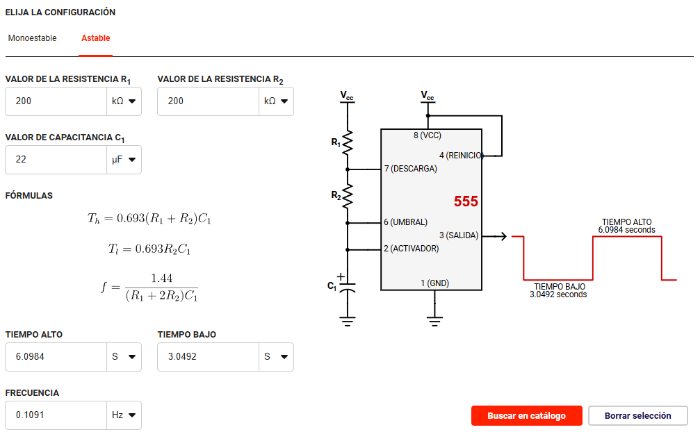

# 📚 Práctica 1: Temporizador Astable con 555


## 1) Resumen

- **Equipo / Autor(es):** _Nombre(s)_  
- **Curso / Asignatura:** _Introducción a la mecatronica_  
- **Fecha:** _05/09/2025_  
- **Descripción breve:** _En esta práctica se diseñó e implementó un circuito temporizador en modo astable utilizando el circuito integrado 555. Se calcularon los tiempos de salida en estado alto y bajo, así como la frecuencia del tren de pulsos generado. Además, se analizaron las fórmulas que rigen su comportamiento y se utilizó un simulador para validar los resultados obtenidos._


---

## 2) Objetivos

- **General:** _Comprender el funcionamiento del temporizador 555 en modo astable y cómo configurar sus tiempos de salida mediante resistencias y capacitores._
- **Específicos:**
  - _Identificar los pines del circuito integrado 555 y su función en modo astable._
  - _Configurar el circuito en un simulador y comprobar el comportamiento de la señal generada._
  - _Interpretar el diagrama de señal de salida en un ciclo completo._

## 3) Alcance y Exclusiones

**Incluye:**
-  _Cálculo de los tiempos de salida (alto y bajo) en función de R1, R2 y C1._

- _Análisis del comportamiento de un circuito 555 en modo astable._

- _Uso de simulador para observar la señal de salida.._

**No incluye:**
- _Implementación en protoboard o hardware real._
- _Programación de microcontroladores.._
- _Control de dispositivos externos con la señal de salida._

---

## 4) Resultados

_Durante la realización de la práctica, se diseñó un circuito astable utilizando el temporizador 555 con los siguientes componentes: dos resistencias de 200 kΩ (R1 y R2) y un capacitor de 22 µF (C1). Estos valores fueron ingresados en un simulador, el cual permitió visualizar tanto la señal de salida como los cálculos correspondientes al comportamiento temporal del circuito. El simulador arrojó un tiempo alto (T₁) de aproximadamente 6.0984 segundos, y un tiempo bajo (T₂) de 3.0492 segundos, lo que indica que la señal permanece más tiempo en estado alto que en estado bajo. La frecuencia del ciclo completo resultó ser 0.1091 Hz, lo cual representa una señal de baja frecuencia, adecuada para aplicaciones donde no se requieren cambios rápidos de estado, como en sistemas de parpadeo o temporizadores de larga duración._




_Al final logramos ver el parpadeo de un led con los valores mostrados, en un circuito armado_

[Video armado](https://youtu.be/qEUT99ln2xI)

---

## 5) conclusiones

_En conclusión, se comprendió satisfactoriamente el funcionamiento del temporizador 555 en modo astable. Se demostró que es posible controlar el ciclo de trabajo y la frecuencia de la señal de salida mediante la elección adecuada de los valores de R1, R2 y C1. Además, el uso del simulador permitió validar los cálculos teóricos, visualizar la forma de onda generada y entender la importancia de cada componente en el circuito._

```
