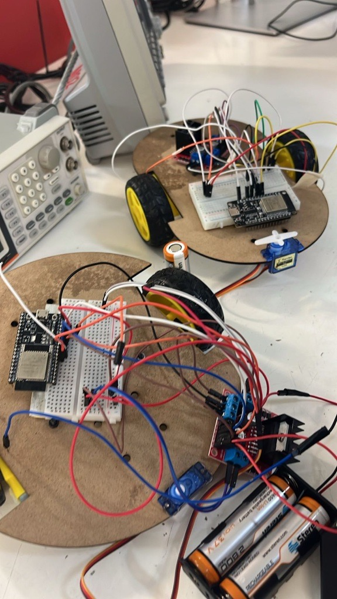

# 📚 Proyecto integrador: Control de vehículo robotizado mediante Bluetooth y ESP32

## 1) Resumen

- **Equipo / Autor(es):** _Tomás Toledo y Karen Itzel_  
- **Curso / Asignatura:** _Introducción a la mecatronica_  
- **Fecha:** _18/10/2025_  
- **Descripción breve:** En esta práctica se desarrolló un sistema de control para un vehículo robotizado utilizando un microcontrolador ESP32 con comunicación Bluetooth. El proyecto permite controlar la dirección y el movimiento del robot a través de comandos enviados desde una aplicación móvil. El sistema integra el control de un servo para el giro del eje delantero y dos motores DC para las llantas traseras, posibilitando movimientos hacia adelante, atrás, izquierda, derecha y alto total.
---
## 2) Objetivos
- **General:** _Diseñar e implementar un sistema de control inalámbrico por Bluetooth utilizando el ESP32 para manejar la dirección y el desplazamiento de un vehículo robotizado.
Específicos:
Configurar la comunicación Bluetooth entre el ESP32 y un dispositivo móvil.
Implementar el control de los motores DC para los diferentes movimientos del vehículo.
---

## 3) Alcance y Exclusiones
**Incluye:**

-Programación en Arduino IDE utilizando el ESP32.

-Control de un servo y dos motores DC conectados al ESP32.

-Control direccional básico: avance, retroceso, giro y detención.

**No incluye:**

-Sensores de distancia o sistemas de detección de obstáculos.

-Comunicación Wi-Fi o control por Internet.
---
## 4) Codigo

```cpp

#include "BluetoothSerial.h"
BluetoothSerial SerialBT;

#define SERVO_PIN 32  // Pin del servo
#define pwm 26        // Pin del control de velocidad
// Controladores del motor de llanta izquierda
#define in1 33
#define in2 25
// Controladores del motor de llanta derecha
#define in3 27
#define in4 14

int angulo = 90; // Posición inicial

void setup() {
  Serial.begin(115200);
  SerialBT.begin("Pancracio2");  // Nombre Bluetooth visible en la app
  Serial.println("Esperando conexión Bluetooth...");

  // PWM del ESP32 para controlar el servo
  ledcAttach(SERVO_PIN, 50, 8);  // Pin, frecuencia 50Hz, resolución 8 bits

  // Salidas de los motores
  pinMode(in1, OUTPUT);
  pinMode(in2, OUTPUT);
  pinMode(in3, OUTPUT);
  pinMode(in4, OUTPUT);

  moverServo(angulo);  // Centra el servo al iniciar
}

void loop() {
  if (SerialBT.available()) {
    int msj = SerialBT.read();
    Serial.println(msj);

    if (msj >= 0 && msj <= 180) {
      moverServo(msj);

    } else if (msj == 182) { // Adelante
      digitalWrite(in1, 1); digitalWrite(in2, 0);
      digitalWrite(in3, 1); digitalWrite(in4, 0);

    } else if (msj == 183) { // Atrás
      digitalWrite(in1, 0); digitalWrite(in2, 1);
      digitalWrite(in3, 0); digitalWrite(in4, 1);

    } else if (msj == 184) { // Giro izquierda
      digitalWrite(in1, 1); digitalWrite(in2, 0);
      digitalWrite(in3, 0); digitalWrite(in4, 1);

    } else if (msj == 185) { // Giro derecha
      digitalWrite(in1, 0); digitalWrite(in2, 1);
      digitalWrite(in3, 1); digitalWrite(in4, 0);

    } else if (msj == 186) { // Alto total
      digitalWrite(in1, 0); digitalWrite(in2, 0);
      digitalWrite(in3, 0); digitalWrite(in4, 0);
    }
  }
}

// Conversión de ángulo a señal PWM
void moverServo(int angulo) {
  int duty = map(angulo, 0, 180, 13, 26);  // Ajusta si el servo no recorre bien
  ledcWrite(SERVO_PIN, duty);
}

```


## 4) Resultados

_El sistema respondió correctamente a los comandos enviados desde el dispositivo móvil. El servo se movió en un rango de 0° a 180°, permitiendo controlar la dirección del vehículo. Los motores DC reaccionaron adecuadamente a los comandos para avanzar, retroceder, girar y detenerse. El enlace Bluetooth se mantuvo estable durante toda la prueba, mostrando una comunicación eficiente entre el ESP32 y el controlador remoto._



_Al final realizar un diseño del vehículo y de la pagna de control que permitiera una correcta conexión entre componentes y codigo_


[Video armado](https://youtube.com/shorts/hgpl0ZoC3SI?feature=share)

---
## 5) conclusiones
_Se logró implementar exitosamente un sistema de control de vehículo robotizado utilizando un ESP32 y comunicación Bluetooth. La práctica permitió comprender cómo se integran servomotores y motores DC dentro de un mismo sistema de control. El uso de comandos numéricos simplificó la comunicación, garantizando una respuesta inmediata del vehículo ante cada orden. Este proyecto constituye la base para desarrollar futuros sistemas autónomos con sensores o control remoto avanzado._
