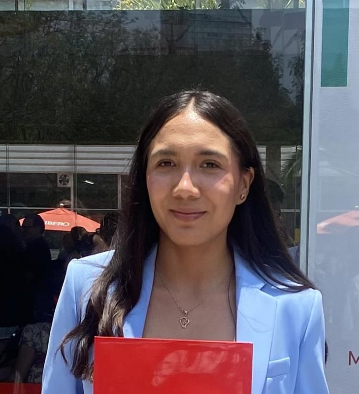

# Documentación del Proyecto Introducción a la mecátronica

##Nuestro Portafolio de Actividades
Introducción a la mecátronica
Departamento de Ciencias e Ingenierías | Universidad Iberoamericana Puebla, México.

---

Karen Itzel Najera De Gante

Ingeniería meátronica | [karen.najera@iberopuebla.mx](karen.najera@iberopuebla.mx)

Resumen:
Soy estudiante de décimo semestre de Ingeniería Mecatrónica, con formación previa en Ingeniería Mecánica. Mi pasión por los desafíos y la innovación me llevó a continuar mis estudios en una segunda carrera, con el objetivo de ampliar mis conocimientos y abrir mayores oportunidades en el campo laboral. Durante seis meses trabajé como analista en EDAG Test Lab México, donde adquirí experiencia en pruebas y validaciones dentro del sector automotriz. Actualmente, sigo desarrollando mis habilidades en áreas multidisciplinarias, combinando mecánica, electrónica y automatización para enfrentar retos tecnológicos con una visión integral.

---
Tomás Toledo Fernández

Ingeniería meátronica | [202945@iberopuebla.mx](202945@iberopuebla.mx)

Resumen:
Soy estudiante de primer semestre de Mecatronica,con estudios previos en el area de físicos matemáticos.Me inspira la evolución y la autosuperacion, lo que me permite todos los dias dar lo mejor de mi para llegar a ser una persona que aporte algo a la humanidad.He estudiado en la universidad la salle oaxaca seccion bachillerato donde obtuve demasiodos conocimentos que me han permitido tener conocimiento escencial para mi carrera.Mi meta es concluir mis estudios en la universidad ,buscar una maestria y ser una persona de cambio.

---

